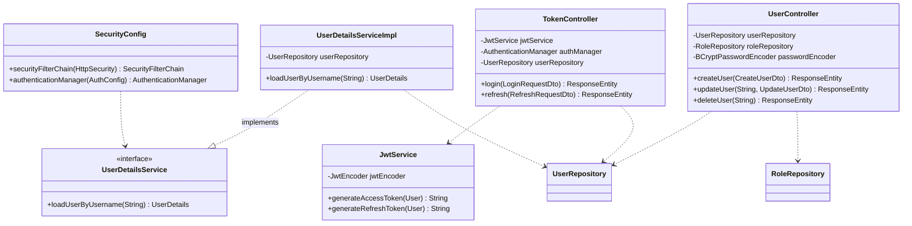

# Authentication Service


A standalone authentication and authorization API built with Spring Boot and
Spring Security, issuing self-signed JWTs (RSA) for stateless, scope-based
access control. Built as a learning/portfolio project.

## Features

- User registration with bcrypt password hashing
- Login issuing a short-lived access token and a longer-lived refresh token
- Refresh-token flow to obtain a new access token without re-authenticating
- Stateless authorization via Spring Security's OAuth2 Resource Server,
  validating JWTs signed with an RSA key pair (no external identity provider)
- Role-based access control (`USER`, `SUPERUSER`) plus per-resource ownership
  checks, so a user can manage their own account but not someone else's
- Schema versioned with Flyway
- OpenAPI/Swagger UI documentation

## Tech stack

- Java 21, Spring Boot 3.4
- Spring Security (OAuth2 Resource Server, JWT)
- Spring Data JPA + PostgreSQL
- Flyway
- springdoc-openapi (Swagger UI)
- Docker & Docker Compose

## Architecture



Access tokens (5 min TTL) carry the user's roles in a `scope` claim and are
validated on every request by Spring Security's resource server filter, so no
database lookup is needed to authorize a request. Refresh tokens (24h TTL)
only carry the user's identity; exchanging one for a new access token still
requires that the user exists.

## API

| Method | Path                 | Auth                    | Description                          |
|--------|----------------------|--------------------------|---------------------------------------|
| POST   | `/api/user`          | Public                  | Register a new user                   |
| POST   | `/api/login`         | Public                  | Authenticate, receive access + refresh tokens |
| POST   | `/api/refresh`       | Public                  | Exchange a refresh token for a new access token |
| GET    | `/api/user`          | `SUPERUSER`              | List all users                        |
| GET    | `/api/user/{username}` | Owner or `SUPERUSER`   | Get a single user                     |
| PUT    | `/api/user/{username}` | Owner or `SUPERUSER`   | Update a user                         |
| DELETE | `/api/user/{username}` | Owner or `SUPERUSER`   | Delete a user                         |

Full request/response schemas are available via Swagger UI once the app is
running, at `/swagger-ui.html`.

```bash
# Register
curl -X POST localhost:8080/api/user \
  -H "Content-Type: application/json" \
  -d '{"username":"lucas","email":"lucas@example.com","password":"secret123"}'

# Log in
curl -X POST localhost:8080/api/login \
  -H "Content-Type: application/json" \
  -d '{"username":"lucas","password":"secret123"}'

# Call a protected endpoint
curl localhost:8080/api/user/lucas -H "Authorization: Bearer <accessToken>"
```

## Running locally

### 1. Generate an RSA key pair

The app signs and validates JWTs with an RSA key pair, provided via the
`JWT_PUBLIC_KEY`/`JWT_PRIVATE_KEY` environment variables.

```bash
openssl genpkey -algorithm RSA -out app.key -outform PEM
openssl rsa -pubout -in app.key -out app.pub
```

### 2. Configure environment variables

Copy [`.env.example`](.env.example) to `.env` and fill in the Postgres
credentials and the two key files generated above.

```bash
cp .env.example .env
```

### 3a. Run with Docker Compose

```bash
docker compose up -d --build
```

This starts Postgres and the API together; migrations run automatically on
startup.

### 3b. Run without Docker

Start Postgres yourself (or `docker compose up -d db`), export the same
variables from `.env` into your shell, then:

```bash
./mvnw spring-boot:run
```

### Default superuser

On first startup, a `superuser` account is seeded (see
[`SuperuserConfig`](src/main/java/com/lucas/auth/configs/SuperuserConfig.java))
with a hardcoded password, purely to have a `SUPERUSER` account to test
admin-only endpoints with locally. Never do this in anything beyond a local
dev environment.

## Project structure

```
src/main/java/com/lucas/auth/
├── configs/        Spring Security, JWT keys, JPA auditing, Swagger, dev-seed data
├── controllers/     REST endpoints
├── dtos/            Request/response records (entities are never exposed directly)
├── entities/        JPA entities
├── exceptions/       Global exception handling
├── repositories/    Spring Data JPA repositories
└── services/        JWT issuing, UserDetailsService
```

## License

MIT — see [LICENSE](LICENSE).

---

Built by [Lucas Storck](https://github.com/LucasStorck)
